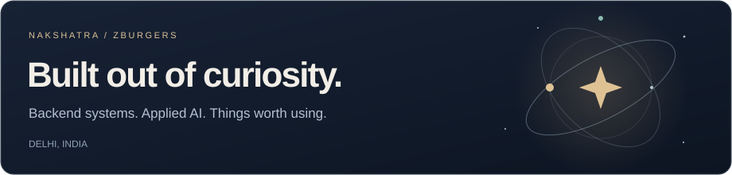
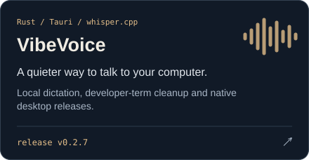
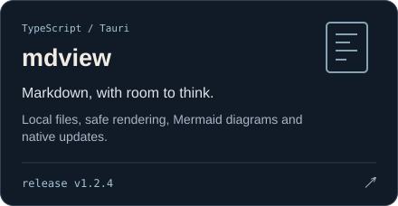
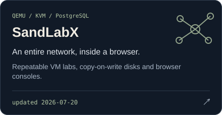
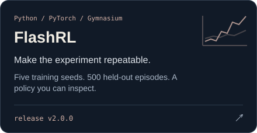
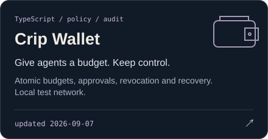
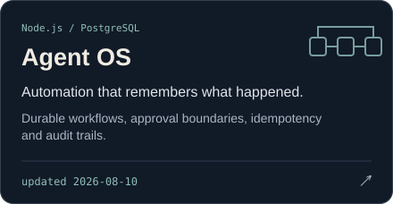
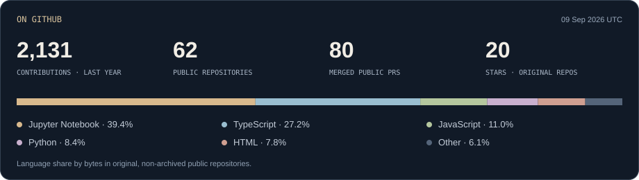

[Blog](https://blog.nakshatraneuratech.dev) · [LinkedIn](https://www.linkedin.com/in/nakshatra-kundlas-7a33a9170/) · [Email](mailto:ekagra7865@gmail.com) · [Open source](https://github.com/pulls?q=is%3Apr+author%3AZburgers+is%3Apublic)

I'm **Nakshatra**, a software engineer in Delhi. I build backend systems, desktop tools that keep your data on your machine, and AI experiments you can actually reproduce.

I like the whole journey: the interface, the database, the background job, and the machine keeping it alive at 2 a.m. Lately that means **Go operations tooling**, safer agent workflows, and turning a spare bare-metal server into a small application platform. Away from the serious bits: Minecraft mods, tiny games, and an unreasonable number of side projects.

## A small detour

Space / ↑ / tap to fly · classic or chill · your best score stays with you

## Things I've built

[Explore all repositories ↗](https://github.com/Zburgers?tab=repositories)

## Beyond my own repos

I contribute fixes where I can follow the problem all the way through: **Snowflake query evidence and file-sync telemetry in [OpenSRE](https://github.com/Tracer-Cloud/opensre)**, and **Discord privacy controls in [Pulse](https://github.com/xt0n1-t3ch/Pulse-Claude-Code-Analytics)**. I also maintain [Minecraft mod ports](https://github.com/Zburgers/more-big-trees)—because sometimes the important engineering problem is bigger trees.

## Notes from the workbench

**[Nakshatra NeuraTech ↗](https://blog.nakshatraneuratech.dev)**

My corner of the internet for experiments, build notes, and what I learn when software meets real use.

## In the commit history

<picture>
  <source media="(prefers-color-scheme: dark)" srcset="https://raw.githubusercontent.com/Zburgers/Zburgers/output/github-contribution-grid-snake-dark.svg">
  <source media="(prefers-color-scheme: light)" srcset="https://raw.githubusercontent.com/Zburgers/Zburgers/output/github-contribution-grid-snake.svg">
  
</picture>

