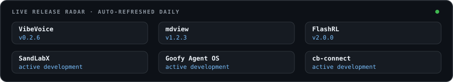

  

   

  
  
  

    

  

## About

I build **reliable AI systems, local-first desktop software, and full-stack products**. My recent work spans agent operations, workflow reliability, developer tooling, privacy-conscious applications, reproducible reinforcement-learning research, and production-minded QA.

I care about software that is understandable, testable, and genuinely useful—not feature volume for its own sake. I also contribute to open-source projects through issue research, focused fixes, testing, and documentation.

## Recently shipped

  
    
  

> The two cards above are generated from published GitHub Releases and refreshed automatically by a scheduled workflow.

## Selected work

| Project | What I am building |
|:---|:---|
| **[VibeVoice](https://github.com/Zburgers/vibevoice)** | A local-first desktop voice-input tool for developers using Tauri and `whisper.cpp`, with configurable dictation controls, developer-term cleanup, diagnostics, privacy-conscious history, and cross-platform release support. |
| **[mdview](https://github.com/Zburgers/mdview)** | A fast, local-first Markdown reader for Linux, Windows, and macOS with reader/source/split modes, Mermaid rendering, safe HTML handling, themes, tabs, search, PDF-friendly printing, and signed update support. |
| **[cb-connect](https://github.com/Zburgers/cb-connect)** | A private, consent-first couples support application for cycle context, body and pain check-ins, relationship signals, and timely support—designed around privacy and careful product boundaries. |
| **[SandLabX](https://github.com/Zburgers/SandlabsX)** | A self-hosted network and systems lab platform built around QEMU/KVM, QCOW2 overlays, Apache Guacamole, PostgreSQL, browser consoles, visual topology editing, and deterministic lab definitions. |
| **[Goofy Agent OS](https://github.com/Zburgers/agent-os)** | A self-hosted control plane for reliable AI-agent and workflow operations with durable state, approvals, idempotency, payment and wallet boundaries, pause/kill controls, and auditability. [Read the reliability case study](https://github.com/Zburgers/agent-os/blob/main/docs/CASE_STUDY_AUTOMATION_RELIABILITY.md). |
| **[FlashRL](https://github.com/Zburgers/FlashRL)** | A reproducible reinforcement-learning research benchmark built around a deterministic Dino simulator, exact frame budgets, held-out multi-seed evaluation, traceable artifacts, and a live policy laboratory. |

## Engineering evidence

| Area | Evidence |
|:---|:---|
| **Shipping** | Cross-platform desktop applications with installable releases, release notes, diagnostics, update paths, and reproducible build checks. |
| **Reliability** | Explicit approval boundaries, idempotent operations, durable state, bounded retries, audit trails, and failure-aware workflow design. |
| **Evaluation** | Deterministic experiments, held-out test seeds, regression suites, scorecards, traceable artifacts, and claims scoped to measured evidence. |
| **Systems** | Linux-first development, Dockerized services, PostgreSQL-backed applications, virtualization tooling, CI workflows, and self-hosted infrastructure. |
| **Open source** | Issue investigation, minimal fixes, regression testing, implementation planning, documentation, and review across public repositories. |

## Open source and current focus

I am currently focused on:

- Building dependable personal-agent infrastructure through **Goofy Agent OS**.
- Shipping and hardening **VibeVoice** and **mdview** as real desktop products.
- Improving **cb-connect** carefully around privacy, notification delivery, and prediction quality.
- Contributing focused fixes and issue research across open-source reliability and developer-tooling projects.
- Expanding reproducible agent and reinforcement-learning evaluation workflows.

[View my public pull requests](https://github.com/pulls?q=is%3Apr+author%3AZburgers+is%3Apublic) · [Browse all repositories](https://github.com/Zburgers?tab=repositories)

## Lab notes and writing

### [Nakshatra NeuraTech Blog](https://blog.nakshatraneuratech.dev)

My personal engineering blog for build logs, system-design notes, experiments, release retrospectives, and lessons from shipping AI products. It is currently a work in progress, but the public home is live.

### [UnderCurrent AI](https://github.com/Zburgers/Undercurrent-AI)

A local-first, one-video YouTube intelligence experiment exploring evidence-backed extraction, analysis workflows, and a focused dashboard experience.

## Core stack

**Languages:** `Python` · `TypeScript` · `Rust` · `Java` · `Bash`  
**Product engineering:** `Next.js` · `React` · `FastAPI` · `Tauri` · `PostgreSQL`  
**AI and data:** `PyTorch` · `Hugging Face` · `scikit-learn` · `Pandas` · `Vector Search`  
**Systems:** `Linux` · `Docker` · `GitHub Actions` · `QEMU/KVM` · `Cloudflare Tunnels`

<b>Selected certifications</b>

 

- PyTorch and Deep Learning for Decision Makers — Linux Foundation
- Prompt Design in Vertex AI — Google Cloud
- Responsible and Safe AI Systems — NPTEL
- Machine Learning with Python — freeCodeCamp

## GitHub activity

  
  

    

  <picture>
    <source media="(prefers-color-scheme: dark)" srcset="https://raw.githubusercontent.com/Zburgers/Zburgers/output/github-contribution-grid-snake-dark.svg"/>
    <source media="(prefers-color-scheme: light)" srcset="https://raw.githubusercontent.com/Zburgers/Zburgers/output/github-contribution-grid-snake.svg"/>
    
  </picture>

## Connect

  
  
  

    

  

  Built on Fedora, powered by curiosity, careful engineering, and Red Bull.

